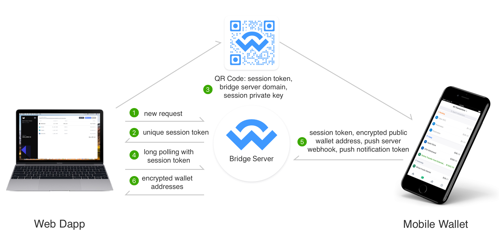

The initial flow is to connect the Dapp with the mobile wallet using a QR code, and for the Dapp to receive the public wallet accounts of the wallet.

* Dapp selects a bridge server to use and requests a unique session ID from the bridge server
* Bridge server generates a unique session ID, stores in Redis, and returns session ID
* Dapp generates a unique symmetric key for this session and creates a pairing QR code which holds:
  * bridge server domain
  * session ID
  * session symmetric key
* Dapp begins long-polling the bridge server for the connecting mobile wallet's details using the unique session ID
* After mobile wallet scans in the QR code, generates a nonce, encrypts public wallet account(s) with session symmetric key, authenticates the ciphertext and nonce and a message counter with the session symmetric key, then pushes the following info to the bridge server to be updated in Redis:
  * unique session ID
  * encrypted public wallet account(s)
  * nonce and message counter
  * HMAC hash
  * wallet push server webhook
  * wallet push notification token

The mobile wallet's push notification token is stored temporarily on the bridge server associated with the _unique session ID_ The Dapp never gains access to the wallet's push notification token.
