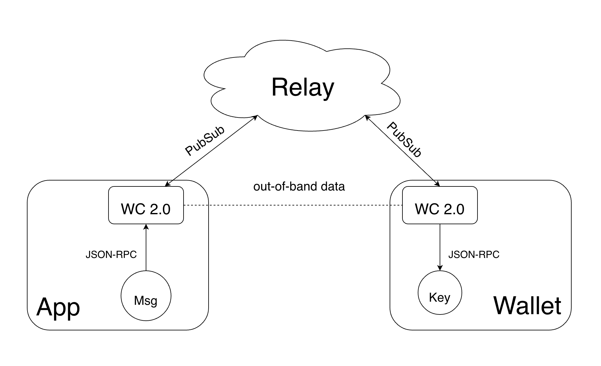
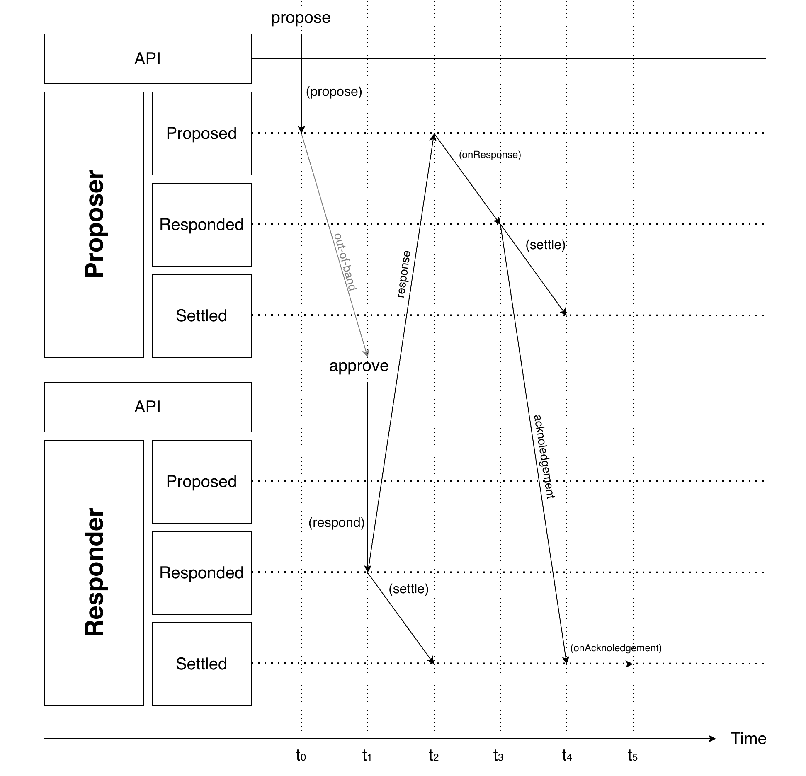
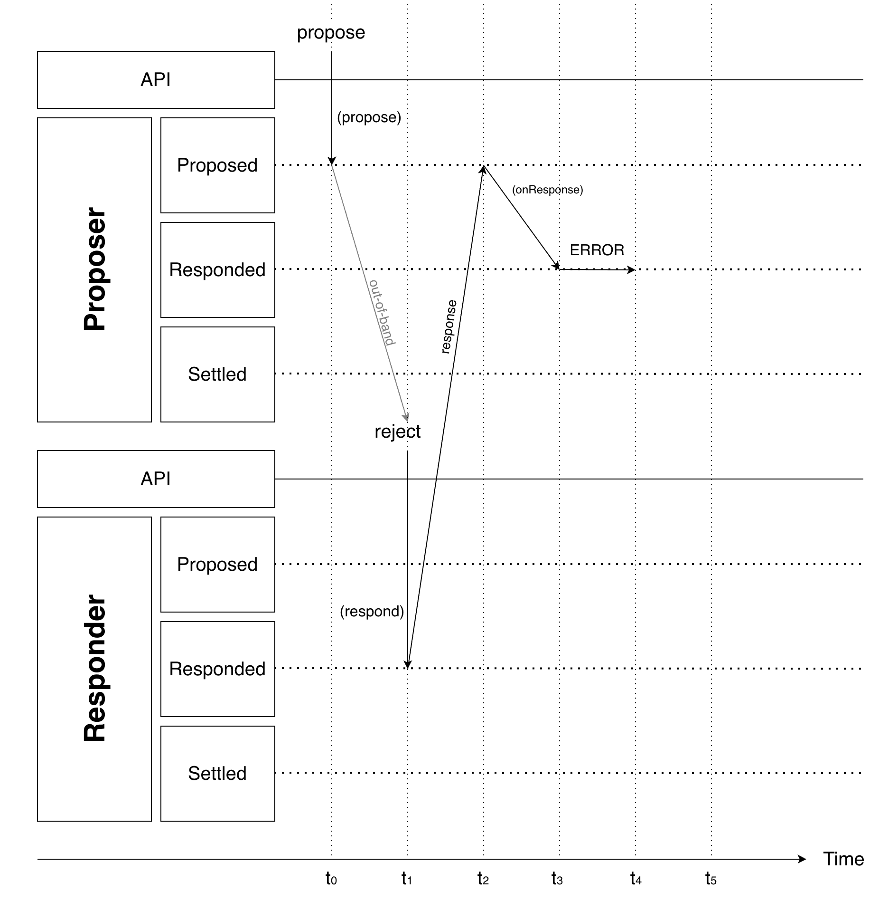
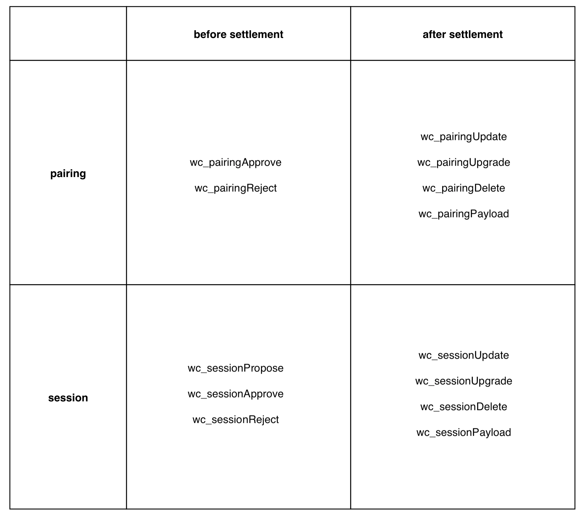

# WalletConnect 2.0 Protocol

## Overview

WalletConnect Protocol provides secure remote signing communication between a blockchain application and wallet which controls the authentication of the user's private keys.

## Goals

The goal of WalletConnect protocol is to provide an interoperable secure remote signing experience between two separate platforms where public key authentication is required to interface with a blockchain. The goals of the WalletConnect protocol include:

- Reducing end-user steps for connecting two platforms securely
- Protect end-user activity across the relay infrastructure
- Allow any blockchain application connect to any blockchain wallet

## Architecture

At a high level, WalletConnect serves a secure communication channel between two applications that run equivalent clients for WalletConnect which are connected to a relay infrastructure communicated through a publish-subscribe pattern.



The two clients are connected when some out-of-band data is shared in order to define the relay infrastructure and the cryptographic keys to used to encrypt payloads.

Usually we have a blockchain application which will be labelled as the proposer and a blockchain wallet which will be labelled as the responder.

After connected the proposer will make signing requests in the form JSON-RPC payloads to the responder to sign with its signer remotely.

In the next sections, we will describe the protocol requirements to implement a client and how to progress sessions from proposal into settlement.

## Requirements

The protocol was designed to serve primarily but not exclusively mobile blockchain wallets which are targeted as the main signing platform for an end-user to manage its private keys for authenticating blockchain interactions.

Hence the following core components were used to ensure secure and low-latency communication between the application and the wallet:

- JSON-RPC protocol
- X25519 shared key derivation
- AEAD encryption scheme
- Publish-Subscribe pattern

Finally the following standards were used to ensure protocol agnosticism to any blockchain interfaces when connecting applications and wallets:

- CAIP-2 blockchain identifiers
- CAIP-10 account identifiers
- CAIP-25 provider handshake
- CAIP-27 provider request

## Backwards Compatibility

WalletConnect 2.0 protocol introduces new concepts when compared to its predecessor which it will purposefully break compatibility in order to provide a more consistent end-user experience across different wallets interfacing with different applications requesting to access different blockchain accounts. Not only WalletConnect 2.0 protocol becomes agnostic to the chain loosing it's strong coupling with the Ethereum blockchain state but also it decouples the session from the pairing. Finally it also introduces a stronger set of rules in terms of session management in terms of lifetime cycles and duration.

In the following sections we will discuss progressively core concepts regarding relay protocols, out-of-band sequences, JSON-RPC payloads, session management, persistent storage and client synchronization.

## Relay Protocol API

Contrary to its predecessor, the WalletConnect 2.0 protocol becomes agnostic to its relay infrastructure. While it's still possible to relay communication between a blockchain application and wallet using the Bridge Server, this is now defined as it's own relay protocol that follows a standard protocol.

The Relay Protocol MUST follow a publish-subscribe pattern and which MUST have a JSON-RPC API interface that includes the following methods and corresponding behaviors with the relay network infrastructure:

- info — status and information about network
- connect — start connection with network
- disconnect — stop connection with network
- publish — broadcast message with a topic to the network
- subscribe — subscribe to messages with matching topic on the network
- unsubscribe — unsubscribe to messages with matching topic on the network
- subscription — incoming message with matching topic from the network

Different protocols MUST have unique method prefixing to prevent conflicts when handling network interactions from the JSON-RPC API interface. For example, the Bridge server infrastructure would include methods such as `bridge_info`, `bridge_subscribe` and `bridge_publish`.

Some relay protocols may require some initialization parameters which need to be shared with another WalletConnect clients with out-of-band communication. For example, Bridge server infrastructure would include the url of the server as parameter:

```typescript
interface RelayProtocolOptions {
  name: string;
  params: any;
}

const protocolOptions: RelayProtocolOptions = {
  name: "bridge",
  params: {
    url: "wss://bridge.walletconnect.org",
  },
};
```

This shares some similarities with the WalletConnect 1.0 protocol which this protocol options were shared through the URI used when scanning a QR Code or deep linked. With the WalletConnect 2.0 protocol, any relay protocol is available therefore these protocols options are open to other potential relay infrastructure available to both the application and the wallet to share out-of-band which leads us to the out-of-band sequences.

## Out-of-Band Sequences

Just like its predecessor at its core there is a concept of a proposer and responder that share some out-of-band information that is not available to the relay protocol in order to relay payloads encrypted. This is now defined with WalletConnect 2.0 Protocol as an out-of-band sequence. There are two different sequences within WalletConnect 2.0 protocol: pairing and session. They both follow the same procedure to settle an out-of-band sequence. Let's first describe the "approve" flow:

- t0 - Proposer generates a sequence proposal that includes a out-of-band data signal and shares with Responder
- t1 - Responder constructs the proposal using the received signal and approves it which internally sends a response
- t2 - Responder optimistically settles session before acknowledgement and in parallel the Proposer receives response
- t3 - Proposer handles and validates response and sends a response acknowledgement to Responder
- t4 - Proposer is able to settle its own sequence and in parallel the Responder receives acknowledgement
- t5 - Responder handles and validates the acknowledgement to be either successful or failed



At this point, both the proposer and the responder have settled a sequence and can now exchange payloads securely using the sequence permissions agree upon. Now let's describe a "reject" flow:

- t0 - Proposer generates a sequence proposal that includes a out-of-band data signal and shares with Responder
- t1 - Responder constructs the proposal using the received signal and rejects it which internally sends a response
- t2 - Responder discards proposal and is not subscribed to any topic and in parallel the Proposer receives the response
- t3 - Proposer handles and validates response and throws an error on the client with the reason received on response



While this conceptually describe the full flow sequence settlement approve and rejects flows, we need to dive into what is actually sent between them when sharing a signal, constructing a proposal, sending a response and/or acknowledgement.

### Pairing Signal

When a pairing sequence is proposed it will use a URI as signal, this will be the out-of-band information shared between the proposer and the responder to construct the proposal. In the URI we will include the following parameters:

```typescript
interface UriParameters {
  protocol: string;
  version: number;
  topic: string;
  publicKey: string;
  relay: RelayProtocolOptions;
}

interface PairingSignal {
  type: "uri";
  params: {
    uri: string;
  };
}
```

### Pairing Proposal

When the responder receives this URI it will be able to construct the pairing sequence proposal.

```typescript
interface PairingParticipant {
  publicKey: string;
}

interface PairingPermissions {
  jsonrpc: {
    methods: string[];
  };
}

interface PairingProposal {
  topic: string;
  relay: RelayProtocolOptions;
  proposer: PairingParticipant;
  signal: PairingSignal;
  permissions: PairingPermissions;
  ttl: number;
}
```

In the constructed proposal we are able to assert the following information:

- topic - subscribed by the proposer on the network to receive response
- relay - relay protocol and parameters used to connect to network
- proposer - public key used by the proposer to encrypted payloads after settlement
- signal - describes the signal parameters shared by the proposer
- permissions - permissions requested by the proposer (default = ["wc_sessionPropose"])
- ttl - time expected to live the settled pairing sequence (default = 30 days)

### Pairing Response

There are two possible outcomes for the response for a pairing proposal: success or failure

#### Success

If the pairing response is successful, then the responder must generate an X25519 key pair as well and derive the shared key for encrypting payloads once settled. Additionally the topic is generated as SHA256 hash of the derived shared key, this way the next topic is only known to both parties. Therefore the successful outcome response should follow as:

```typescript
interface PairingSuccessResponse {
  topic: string;
  relay: RelayProtocolOptions;
  responder: PairingParticipant;
  expiry: number;
}
```

**Note:** expiry is calculated using the sum of the timestamp at time settled by the responder and the ttl proposed by the proposer

#### Failure

If the pairing is not successful, either because the responder rejected or any client errors occurred during settlement then the failure outcome response should follow as:

```typescript
interface PairingFailureResponse {
  reason: string;
}
```

**Note:** in practice there shouldn't be any reason to reject a pairing proposal since it's only used for signaling sessions

### Pairing Settlement

After response, the proposer should be able to settle its own sequence with the details shared. The responder public key is used for deriving the shared key and the derived topic should match the response topic. Finally it includes the expiry calculated by the responder and the pairing is considered settled by both clients. The settled pairing is structured as follows on both clients:

```typescript
interface PairingSettled {
  topic: string;
  relay: RelayProtocolOptions;
  sharedKey: string;
  self: PairingParticipant;
  peer: PairingParticipant;
  permissions: PairingPermissions;
  expiry: number;
}
```

By now you should have noted that we have specified permissions but by default we only use a single method `wc_sessionPropose` allowed. This takes us to how pairing and session relate to each other.

On the WalletConnect 1.0 protocol, a pairing was established per session which made bandwidth requirements for sessions unnecessarily high. Now with WalletConnect 2.0 protocol pairings are settled independently of the sessions. With a settled pairing being used as a secure channel, sessions can be initiated between two platforms.

Once two participants are paired, their communications are encrypted through the pairing. The participants can use the pairing topic to derive shared key to send detailed session proposal with specified permissions through the relay network.

Therefore the next sequence, session, will follow the same procedure for settlement but it will relay its out-of-band session proposal through the encrypted settled pairing.

### Session Signal

When a session is proposed through a settled pairing it will use a signal with a topic field matching the pairing topic used to relay the proposal.

```typescript
interface SessionSignal {
  method: "pairing";
  params: {
    topic: string;
  };
}
```

### Session Proposal

The proposal will be listened to as part of the params of the `wc_sessionPropose` relayed across the pairing settled and it will be structured as follows:

```typescript
interface SessionMetadata {
  name: string;
  description: string;
  url: string;
  icons: string[];
}

interface SessionParticipant {
  publicKey: string;
  metadata: SessionMetadata;
}

interface SessionPermissions {
  blockchain: {
    chains: string[];
  };
  jsonrpc: {
    methods: string[];
  };
}

interface SessionProposal {
  topic: string;
  relay: RelayProtocolOptions;
  proposer: SessionParticipant;
  signal: SessionSignal;
  permissions: SessionPermissions;
  ttl: number;
}
```

Session proposal look somewhat similar to pairing proposal except for two particularities: participant metadata and blockchain permissions;

#### Participant Metadata

The metadata here is similar to v1.0 protocol and is displayed to the user to identify the proposal comes from the application that is attempting to connect remotely. It's also used to identify settled sessions after approval

#### Blockchain Permissions

The blockchain permissions together with the JSON-RPC methods that are described in parallel are complaint with CAIP-25 provider handshake parameters used to dictate the rules that will be used for the session. chains are CAIP-2 blockchain identifiers that the application is requesting exposure from the wallet and the JSON-RPC methods are the set of methods the application requires from the wallet to fully support in order to establish a successful session sequence.

### Session Response

Just like pairing sequence, session can have two outcomes for its response: success or failure

#### Success

The session response will be successful when the user approves the session proposal and the wallet verifies that it supports the requested blockchains and JSON-RPC permissions.

Given that these conditions are met then the wallet will expose CAIP-10 blockchain accounts corresponding the requested blockchains and will derive a shared key to be used after session settlement.

```typescript
interface SessionState {
  accounts: string[];
}

interface SessionSuccessResponse {
  topic: string;
  relay: RelayProtocolOptions;
  responder: SessionParticipant;
  expiry: number;
  state: SessionState;
}
```

#### Failure

If the session is not successful, either because the user did not approve, permissions requested were not fully supported by the wallet or an error occurred during settlement then the response should be structured as follows:

```typescript
interface SessionFailureResponse {
  reason: string;
}
```

### Session Settlement

After response, the proposer should be able to settle its own sequence with the details shared. The responder public key is used for deriving the shared key and the derived topic should match the response topic. Finally it includes the expiry calculated by the responder and the session is considered settled by both clients. The settled session is structured as follows on both clients:

```typescript
interface SessionSettled {
  topic: string;
  relay: RelayProtocolOptions;
  sharedKey: string;
  self: SessionParticipant;
  peer: SessionParticipant;
  permissions: SessionPermissions;
  expiry: number;
  state: SessionState;
}
```

At this stage, we can consider two applications fully connected. A session has settled on both clients and the permissions have been established on both clients to exchange JSON-RPC payloads.

## JSON-RPC Payloads

Now that WalletConnect 2.0 protocol is agnostic to the blockchain interface, it was important to dictate the rules upfront before session settlement to ensure a consistent end-user experience across multiple blockchain applications being interoperable with multiple blockchain wallets.

Therefore we will add support for CAIP-27 provider requests which will allow JSON-RPC requests to be accompanied by chainId target, this is translated as JSON-RPC request in WalletConnect between the two clients as follows:

```typescript
interface CAIP27Request {
  id: number;
  jsonrpc: string;
  method: "caip_request";
  params: {
    request: {
      method: string;
      params: any;
    };
    chainId?: string;
  };
}
```

This allows a blockchain application to be connected to a blockchain wallet on multiple chains at the same time and target requests individually. While chainId is optional, is highly recommended that is used by all providers built on top of the WalletConnect 2.0 protocol.

## Session Management

Contrary to its predecessor, WalletConnect 2.0 protocol is opinionated about session management on two fronts: lifecycles and duration.

### Lifecycles

As already explained on the out-of-band sequences which describe how pairings signal session proposals. It's now important to note that session lifecycles are decoupled from the URI scanning or deep-linking which previously coupled to each session.

A session is proposed only through a paired pairing which can displayed to a user on multiple applications. Therefore it's necessary that wallets design sessions to live in parallel and permit users to approve requests from different sessions simultaneously.

A JSON-RPC request from a session should never be displayed from an "active" session since multiple can be active at the same time.

### Duration

Additionally not only multiple sessions can be settled simultaneously, sessions MUST be persisted for the entire duration until expiry is met.

Only the user can terminate a session intentionally before the expiry is met therefore these sessions should be displayed in parallel on a session manager where the user can control which applications are still connected and can make requests.

Therefore the sessions are stored controlled by the client to ensure the lifecycles and duration are respected. Which takes us to how persistent storage is handled by clients

## Persistent Storage

WalletConnect 2.0 clients are now also in control of persistent storage to ensure sessions are managed correctly on both sides hence the minimum requirement for a client to be compatible in all platforms by providing a basic key-value storage interface with asynchronous methods for get, set and delete

## Client Synchronization

WalletConenct 2.0 clients will synchronize state and events for the out-of-band sequences, both session and pairing, through JSON-RPC methods which are exclusively used to communicate between the two connected clients. These will be published and subscribed under corresponding topics for both before and after settlement. This can be described under a single matrix that encompasses these two states for both sequences.



### wc_pairingApprove

This request is sent as response for a pairing proposal which is signaled externally using a URI shared between clients.

```typescript
interface WCPairingApprove {
  id: 1;
  jsonrpc: "2.0";
  method: "wc_pairingApprove";
  params: {
    topic: string;
    relay: RelayProtocolOptions;
    responder: PairingParticipant;
    expiry: number;
  };
}
```

**NOTE:** The response for this request will serve as the acknowledgement of the proposer's pairing settlement

### wc_pairingReject

This request is sent as response for a pairing proposal which is signaled externally using a URI shared between clients.

```typescript
interface WCPairingReject {
  id: 1;
  jsonrpc: "2.0";
  method: "wc_pairingReject";
  params: {
    reason: string;
  };
}
```

**NOTE:** The response for this request will serve as the acknowledgement of the proposer's pairing settlement

### wc_pairingUpdate

This request is used to update metadata of the pairing participant which is optionally provided to make it easier to identify the peer's platform and version.

```typescript
interface WCPairingUpdate {
  id: 1;
  jsonrpc: "2.0";
  method: "wc_pairingUpdate";
  params: {
    update: {
      peer: {
        metadata: {
          type: string;
          platform: string;
          version: string;
          os: string;
        };
      };
    };
  };
}
```

### wc_pairingDelete

This request is used to delete the pairing and notify the peer that it won't be receiving anymore payloads being relayed with this topic and specifies a reason for deleting before expire.

```typescript
interface WCPairingDelete {
  id: 1;
  jsonrpc: "2.0";
  method: "wc_pairingDelete";
  params: {
    reason: string;
  };
}
```

### wc_pairingPayload

This request is used to relay payloads that match the list of methods agreed upon pairing settlement. Any requests sent with unauthorized methods will be immediately rejected by the client.

```typescript
interface WCPairingPayload {
  id: 1;
  jsonrpc: "2.0";
  method: "wc_pairingPayload";
  params: {
 		request: {
      method: string;
      params: any;
    }
  };
}
```

### wc_sessionPropose

This request is used send a session proposal to a client which has an already settled pairing therefore this method exists exclusively within a pairing payload and it's the only method permitted to be relayed through a pairing.

```typescript
interface WCSessionPropose {
  id: 1;
  jsonrpc: "2.0";
  method: "wc_sessionPropose";
  params: {
    topic: string;
    relay: RelayProtocolOptions;
    proposer: SessionParticipant;
    signal: SessionSignal;
    permissions: SessionPermissions;
    ttl: number;
  };
}
```

### wc_sessionApprove

This request is sent as response for a session proposal which is signaled externally using a URI shared between clients.

```typescript
interface WCSessionApprove {
  id: 1;
  jsonrpc: "2.0";
  method: "wc_sessionApprove";
  params: {
    topic: string;
    relay: RelayProtocolOptions;
    responder: SessionParticipant;
    expiry: number;
    state: SessionState;
  };
}
```

**NOTE:** The response for this request will serve as the acknowledgement of the proposer's session settlement

### wc_sessionReject

This request is sent as response for a session proposal which is signaled externally using a URI shared between clients.

```typescript
interface WCSessionReject {
  id: 1;
  jsonrpc: "2.0";
  method: "wc_sessionReject";
  params: {
    reason: string;
  };
}
```

**NOTE:** The response for this request will serve as the acknowledgement of the proposer's session settlement

### wc_sessionUpdate

This request is used to update state of the session participant which is optionally provided by the responder extra accounts during the session lifetime;

```typescript
interface WCSessionUpdate {
  id: 1;
  jsonrpc: "2.0";
  method: "wc_sessionUpdate";
  params: {
    update: {
      state: {
        accounts: string[];
      };
    };
  };
}
```

### wc_sessionDelete

This request is used to delete the session and notify the peer that it won't be receiving anymore payloads being relayed with this topic and specifies a reason for deleting before expire.

```typescript
interface WCSessionDelete {
  id: 1;
  jsonrpc: "2.0";
  method: "wc_sessionDelete";
  params: {
    reason: string;
  };
}
```

### wc_sessionPayload

This request is used to relay payloads that match the list of methods agreed upon session settlement. Any requests sent with unauthorized methods will be immediately rejected by the client.

```typescript
interface WCSessionPayload {
  id: 1;
  jsonrpc: "2.0";
  method: "wc_sessionPayload";
  params: {
    request: {
      method: string;
      params: any;
    };
    chainId?: string;
  };
}
```
